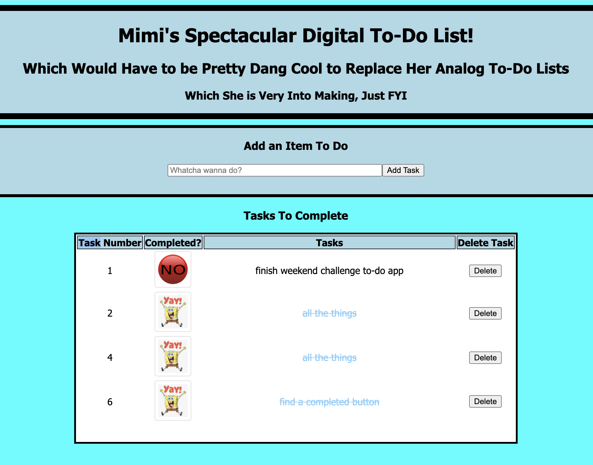

# Project Name

Mimi's Spectacular Digital To-Do List!

## Description

- I completed the base mode in two days, about seven hours total. I wanted to spend any extra time I had Sunday and Monday exploring Bootstrap, branching, and other stretch goals.

- The base mode assignment was to create a to-do list that utilized the full stack, the full range of AJAX options (create, read, update, delete ), and the new SQL/database stuff we've been learning.

## Screen Shot


## Prerequisites

- Node.js
- install express and PG
- database and table created according to the database.sql file

## Installation

PHASE ZERO
===

- spend some time creating an epic to-do list about my to-do list to get organized and prioritize

PHASE ONE: Basic Setup
===
(I tried to do as much as possible of this without copy/pasting so that I can get the placement of everything in my head a little better)

- git init
- npm init --y
- npm install express pg, update start scripts "start": "node server/server.js"
- spin up server
    requires (express, app, bodyparser)
    uses (static files, bodyparser)
    globals (const port)
    spin up server (app.listen)
- serve index.html/scripts/styles/vendors within a public file within the server file
- source scripts in html
- .gitignore .DS_Store and node_modules
- test the server
- git commit

PHASE TWO: Adding database and connection
===

- make sure you've npm installed pg
- create a "pool.js" in a modules folder in the server folder
- require pg
- make sure to export it ex: ```module.exports = pool```
- require it on the server ex: ```const pool = require( './modules/pool' );```
- create a database for the project.  Use the name `weekend-to-do-app`. It will need a primary key serial number, a text task, and a 'completed' boolean.
- make a database.sql file that includes all of your `CREATE TABLE` queries so instructors can re-create your database while testing your app.
- git commit

PHASE THREE: Interface/GET/POST
===

- allow a user to create a Task on the DOM with inputs and a button to submit the task.
- create a table for the to-do list that includes an option to 'Complete' (update) or 'Delete' (you guessed it) for each task
- capture the click event for the submit button in the onReady
- create a function that captures the user input and sends an AJAX POST req to the server
- input the new task into the db using a POST route on the server side
- create a GET function and route that gets all tasks from the database and displays them on the DOM.
- git commit

PHASE FOUR: Complete (update) function/Toggle class
===
- When a Task is complete, its visual representation should change on the front end. The complete option should be  'checked off'. I want the completed button to change from one image to another. This will happen with some classes and an if/else statement when appending to the DOM.
- text color change as well? crossed out using text decoration in CSS
- capture the click ( dynamically created )
- run a function where an AJAX PUT req is sent to the server using this data id. 
- in the server, use SQL to update the boolean in the database. Use the koala repo as reference for this since I wasn't there for this during the group project.
- does it need to un-complete if user clicks it again? Or, since it's a to-do list, prob not. my checklists on iphone only go one way
- git commit

PHASE FIVE: Delete function
===
- add a delete button to the HTML in the GET, assign it a class
- capture delete button click (dynamically created) in the onReady
- create a function that sends an AJAX DELETE req to the server in the client using $(this).data( 'id' ) 
- in the server, delete the task row from the database using req.query.id
- get the updated array and displays it on the DOM
- git commit

FINAL PHASE of base mode:
===
- update database.sql file if any changes were made
- update the readme.md to get it ready to submit
- clean up/add comments where necessary
- clean up the CSS
- git commit and submit assignment!

## Usage

The user can add items to a to-do list that is displayed on the page, delete unwanted items from the list, and mark items as completed.

## Built With

- Express and PG
- Javascript, JQuery and SQL

## Acknowledgement

I'd like to thank my cohort for the extra help, especially Amanda and Chris N for always giving me the right nudge or tip when I get stuck.

## Support

Any issues, feel free to hit me up on Slack :)